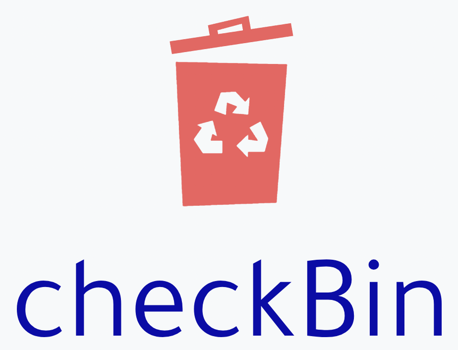
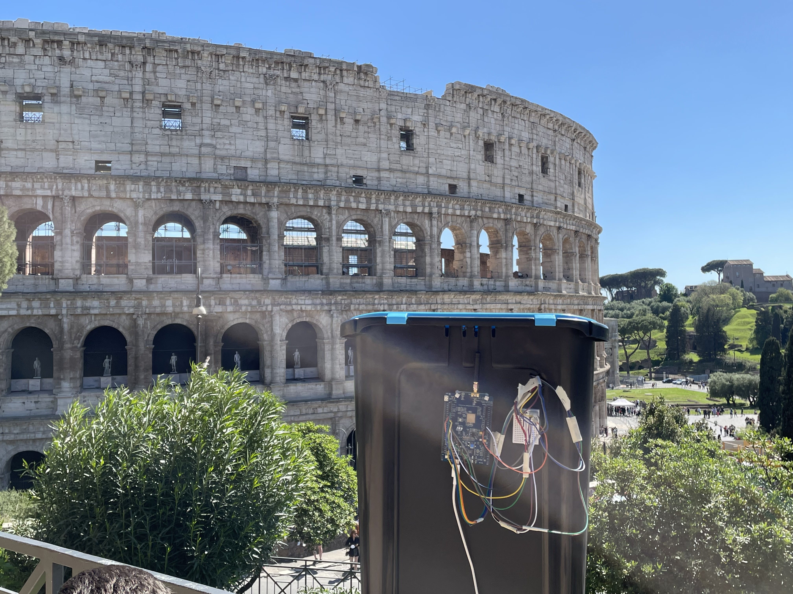

## Group Members:

- Alessandro Marzilli - [LinkedIn Profile](https://www.linkedin.com/in/alessandro-marzilli-84a07a235/)
- Andrea Mazzitelli - [LinkedIn Profile](https://www.linkedin.com/in/andrea-mazzitelli-795ab4234/)
- Andrea Rodriguez - [LinkedIn Profile](https://www.linkedin.com/in/andrea-rod/)

## Description of the Project:

Today a big issue in many cities is garbage management, not only from an aesthetical point of view but also regarding administration and logistics costs. For this reason we envisioned a network of smart bins that monitor the fill level and give updates on their status. In this way the garbage pickup companies can have an overall view of the real-time situation and act accordingly. They could plan efficient pickup routes based on the fill level of the bins, manage the number of bins in each area and base their decisions on statistical analysis of provided data. As a consequence not only the company’s resources are used in a more efficient way but also the urban welfare increases thanks to less garbage on the streets and increased usability of the bins.

## Prototype:

## Blogpost:
- [Link to hackster](https://www.hackster.io/)

## Documents:
### Third delivery:
- [Concept](/doc/Third%20Delivery/Concept.md)
- [Technology](/doc/Third%20Delivery/Technology.md)
- [Evaluation](/doc/Third%20Delivery/Evaluation.md)
### Second delivery:
- [2nd Delivery](/doc/Second%20Delivery/2ndDelivery.md)
- [Concept](/doc/Second%20Delivery/Concept.md)
- [Technology](/doc/Second%20Delivery/Technology.md)
- [Evaluation](/doc/Second%20Delivery/Evaluation.md)
### First delivery:
- [Concept](/doc/First%20Delivery/Concept.md)
- [Technology](/doc/First%20Delivery/Technology.md)
- [Evaluation](/doc/First%20Delivery/Evaluation.md)

## Videos:
### Third delivery:
- [Presentation of the project]()
- [Demonstration of the project]()
### Second delivery:
- [Technical details](https://youtu.be/C8MtbwdandU)
- [Evaluation](https://www.youtube.com/watch?v=46vqiiF-4S0)
- [Future plans](https://www.youtube.com/watch?v=kTAaOJ-Nj90)
### First delivery:
- [Concept](https://youtu.be/G0L1xYLjtnY)
- [Technology](https://youtu.be/uhQEX0K4BaE)
- [Evaluation](https://youtu.be/skyZr8n79Us)
