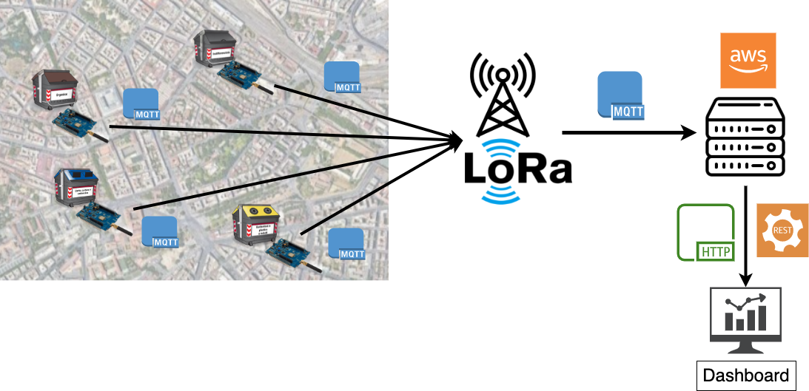

# TECHNOLOGY

## General Architecture

***Computation***
The computation is carried both on the edge and in the cloud. Every board will compute the fill level through the data coming in from the sensors and will send only this refined value to the cloud once every hour. The cloud will generate a dashboard with a map of the city combining the data received together with the database which links every bin identifier to its location. This dashboard will be publicly available through http both to the garbage collection company and to the citizens.

## Bin Overview

Every smart bin will have an id code to be identified, which is also linked to its position. It will be equipped with:

***LoRaWAN compatible STM board***
STM32L0 Discovery kit LoRa, Sigfox, low-power wireless. The module is powered by an STM32L072CZ microcontroller and SX1276 transceiver. The transceiver features the LoRa long-range modem, providing ultra-long-range spread-spectrum communication and high interference immunity, minimizing current consumption.
In the cities there should be some LoRaWAN gateways to pick up all the signals sent by the bins.
We plan to use MQTT-SN as communication standard between the Smart bins and the LoRa gateway and MQTT as communication standard between the LoRa gateways and the Cloud provider.

***Ultrasonic sensors*** to measure occupied volume in the bin.
We use ultrasonic sensors as the main way of measuring the filling level of the bins.

***Load cells and a Load Cell Amplifier*** to measure weight of the trash in the bin.
To avoid anomalies in the data read by ultrasonic sensors we plan to also use load cells. Together with statistics based on gathered data we can compare the occupied volume in the bin and the weight to understand if there is an anomaly in the ultrasonic measure.

***LCD Monitor*** to show fill level to the citizens.
The LCD Monitor will provide information about the fill level. It will also be used to give instant feedback to the citizens using the bin. In this way they can be more involved in the process and take responsibility.

***Servo motor*** to lock the opening of the bin when it is full.

## Constraints

***Battery and Energy Consumption***
A major constraint that we have is energy consumption. We want to keep it as low as possible so that the battery can be changed a few times or none at all. During the development phase we’ll choose if we need to add some kind of solar cell or other type of charging methods. As an example we could experiment with some kind of fast charge while the trucks unload the bins. We will also carefully adjust the duty cycle to consume as little as possible, keeping in mind that:
- The LCD screen will be always on and will be updated at every change of the weight
- The servo motor will be activated only when the bin is full or recently emptied
- The ultrasonic sensor will be activated only when a change in the weight is detected
- The load cells will be always measuring weight changes
- LoRa antenna will be activated every hour to send to the cloud the current fill level

***Network***
This architecture does not have any particular network constraint. We plan to update the data on the cloud every hour, so the expected latency can be also in the order of minutes. This choice has been made considering the nature of the system which does not always need real time updates.
We’ll send to the cloud only the fill level of the bins, so the bandwidth needed by each device is minimal. Even though we take into account the great number of bins that even a small city has, the overall data transmitted is not much. Having planned a high update latency implies fewer usage of the radio that can be turned off saving energy.
