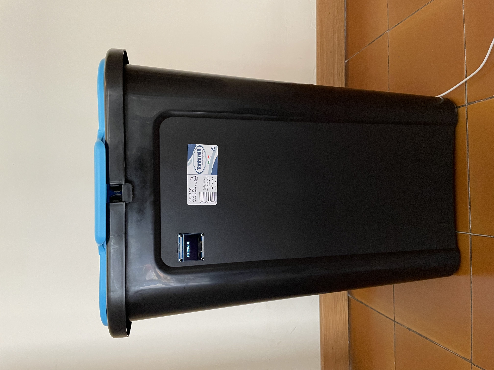
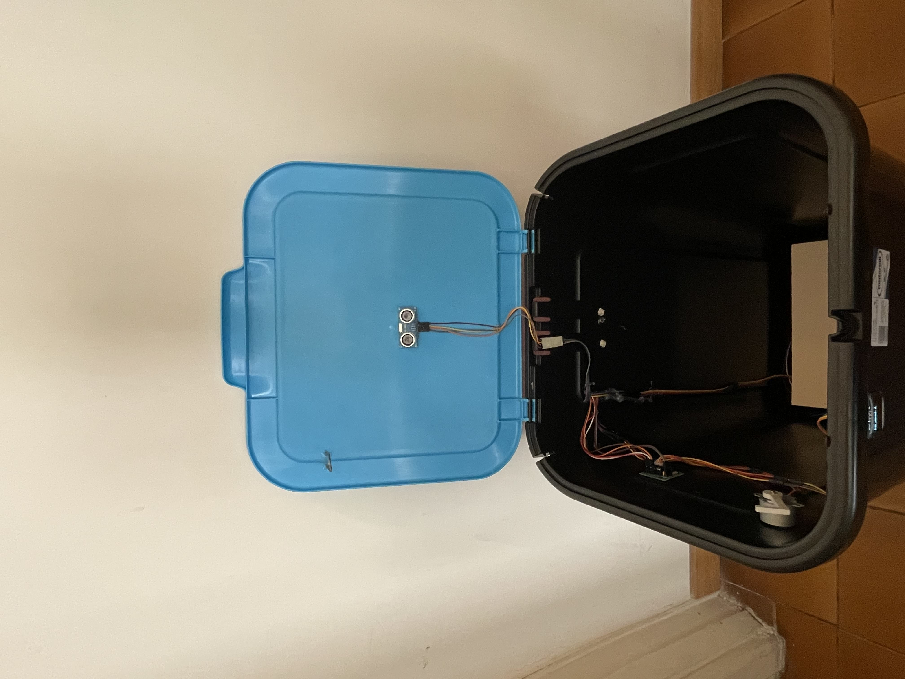
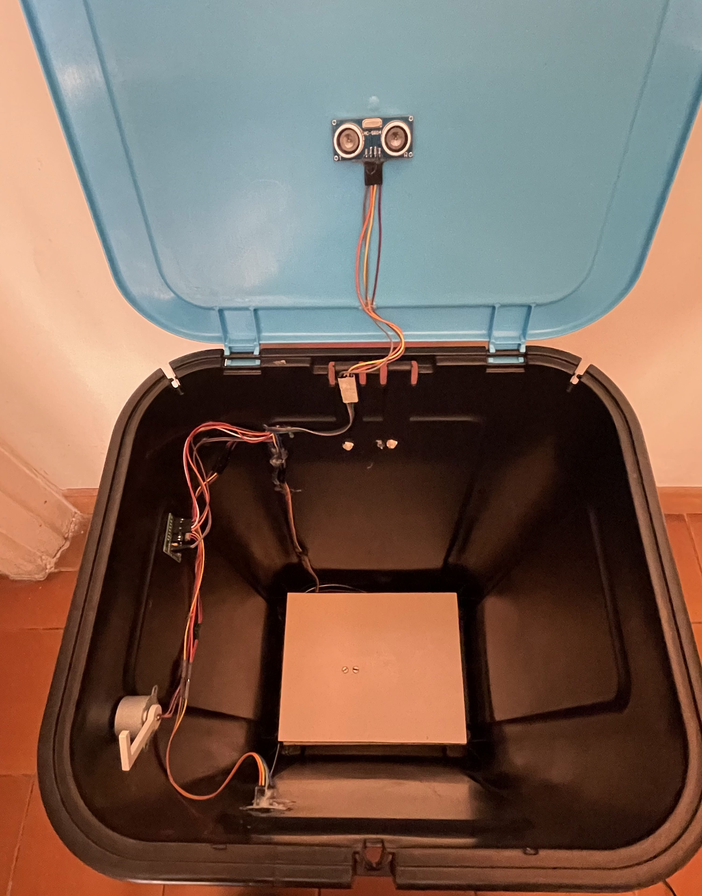
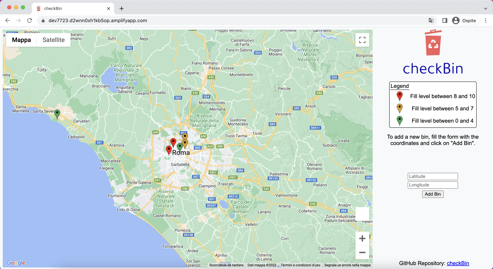

# 2nd delivery

## Addressing the comments received during the 1st delivery:
During the first delivery we received the following main comments:
1. What are the requirements? As low as possible is not a requirement.
2. Do you expect a sampling every second, hour or what?
3. Accuracy of fill level can be an issue.
4. Precision and recall.

And we address them in the following way:
1. We decided a lower bound for the battery replacement, it should last no less than a year. In this way the price of the logistics to replace the batteries would not impact the company’s balance sheet. To achieve this goal we’ll measure more in detail the power consumption of our system and we’ll experiment with charging methods.
2. We performed a study on the sampling rate, discussing several possibilities. In particular, we analyzed the following ones: 
  - continuous sampling: gives us the best feedback but it is expensive in terms of energy cost.
  - continuous sampling of one sensor and sample on the other when needed: surely a better solution than the previous one. If we keep ON only the sensor that consumes less energy and use the other to check for correctness, we can achieve good feedback from the device while reducing the energy consumption with regard to the previous case.
  - periodic sensing: is the solution that we went for. It allows us to tailor a duty cycle that gives good enough feedback, while keeping an energy consumption that fits our needs.
  This is a brief overview of the analysis, the complete one can be found in the Evaluation document.

3. To address issues in the accuracy of the fill level, we implemented a double check measurement which let us detect anomalies in the system. Indeed we also use a load cell which returns the real weight. This measurement is then compared with the estimated one computed using the fill level, the base area and the waste type. More details can be found in the Technology document.

4. We performed tests and measurements using our prototype to analyze the frequency of errors and anomalies. The gathered data can be found in the Evaluation document.

## Changes in the architecture: 
- Servo Motor → Step Motor: we made this change due to a limitation of the RIOT OS software. Indeed, RIOT does not implement the PWM Interface for our board b-l072z-lrwan1. So we decided to use the step motor that only requires the basic gpio.

- LCD Monitor → OLED Display: we made this change because the LCD monitor we have available uses 12 pins but the chosen board (b-l072z-lrwan1) doesn’t have enough. The OLED display we went for requires only 4 pins, so we could fit it in the pins schematics.

## Technical work:
Since the last delivery the following things were done:
- we built a prototype;
- we developed the code for the board;
- we configured the connection between the board and The Things Network;
- we defined with more precision which AWS services to use and how they interact with each other, also developing the code running on the cloud;
- we developed the web interface;

### Prototype Build:
We used a different kind of bin from the one shown in the overview of the project. That is because of the unavailability of a standard garbage bin in this first development phase. However, the system we built is easily adaptable to different kinds of bins. We built the following prototype.

### Code on the Board:
Since the last delivery we wrote the necessary functions to:
- read values from the sensors;
- act using the actuators;
- send data using LoRa;

Moreover we wrote all the logic that governs the system using the above functions. More details about this aspect can be found in the Technology Document.

### AWS:
We defined what AWS services to use. We chose:
- AWS IoT Core: to receive data from The Things Network and invoke a Lambda function;
- AWS Lambda: to implement the functions needed to interact with the database;
- AWS DynamoDB: to store the data and easily have access;
- AWS Amplify: to host the static content of the web interface and make it easily accessible.

### Web Interface:
We developed the web interface to show the user a map with markers and fill levels, also allowing him to add new bins.

You can find the web interface [here](https://dev7723.d2wnn0xh1kb5op.amplifyapp.com).

## Plans for 3rd delivery:
- Better evaluation on energy consumption, also to adjust the duty cycle on our needs.
- Try different charging methods if needed.
- Web socket implementation to update the fill levels on the dashboard in real time.
- Better statistics on the specific weight for each waste type, based on tests.
- New button in the dashboard to delete a bin, given its identifier.
- Show the fill level as a progress bar on the oled display.
- Add a button or an NFC reader (if the energy consumption does not affect the battery lifetime) to open the bin when it is going to be emptied.
- Consider the possibility of using as bin identifier the DEV_EUI assigned to the board for the LoRa communication, removing the bin identifier in the message sent from the board to the cloud.
- Study the power management API of RIOTos to understand if it can be useful for our purposes.
- Implement security aspects of the communication from the board to the cloud.

## Evaluation conducted since the 1st delivery:
We performed the following evaluation:
- we analyzed in more detail the energy consumption of our system;
- we analyzed different possibilities for the sampling frequency and the radio usage, to choose the strategy that suits our application best;
- we measured the sensors’ precision;
- we conducted some tests to evaluate the accuracy of the system;
- we briefly discussed network aspects of the system, such as network usage and latency.

## Next evaluation phase:
We will focus more on energy consumption, which is a key aspect for our system. We will take more accurate measures using our prototype in different settings.
  We will also evaluate different charging methods to find out if there exists a viable option.

