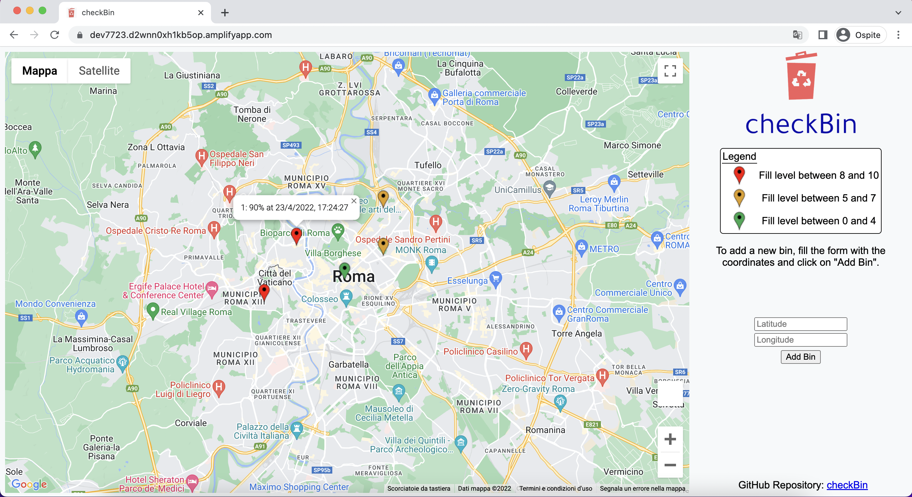

# CONCEPT

The main problem of waste management in big cities is overflowing bins. This brings to garbage left on the streets, bad smells, wild animals roaming and fed up citizens. It is the consequence of an inefficient usage of the resources by garbage pickup companies, both economical and logistical (employees time and garbage trucks). As an example it happens that the usual pickup route empties not yet full bins missing the full ones.

IoT could help solve this problem without having to hire new workers nor buying new trucks, which would generate more long term expenses for the company. Through a network of intelligent devices we can monitor the fill level of every trash bin and aggregate this data to generate a centralized and complete knowledge on the real time situation of the bins in the city.
Using this knowledge companies could plan efficient pickup routes based on the fill level of the bins. They could also make statistical analysis on the collected data to tailor the number of bins in each area according to the real needs.

In this way the urban welfare increases thanks to less garbage on the streets and increased usability of the bins. Another result is an improvement on how the public perceives the garbage collection company and the city administration. The flow of tourists to the city could be impacted by the usage of our system too, as a consequence of the improvement in the city reputation.

An IoT solution is required due to the intrinsic nature of the considered environment: garbage bins are spread over large areas which would be otherwise impossible to monitor. Moreover this solution can also help detect unusual filling rates due to unpredictable events.

This system could be integrated in a urban regeneration plan for a smart city. It would be useful also to measure the change in the level of awareness of the population on ecological issues, measured as percentage of waste diverted from disposal to recycling facilities during several years or in several places. Through our system we expect an increase of the citizens' involvement and responsibility and a better precision in the gathered data, regarding the quantities but also by doing statistics on specific areas of the city where there could be projects to increase awareness on ecological issues.

### Link to previous version: [Concept - First delivery](../First%20Delivery/Concept.md)
