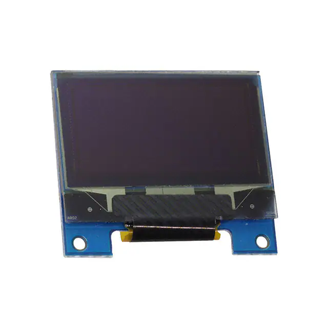
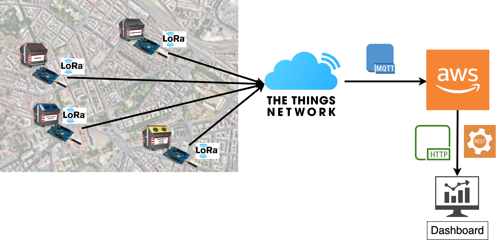
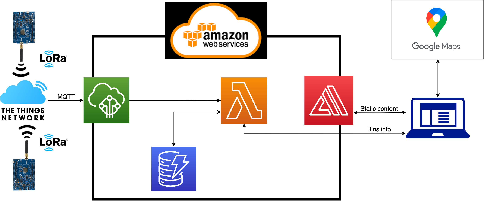

# TECHNOLOGY

## General Architecture

The computation is carried both on the edge and in the cloud. Every board will compute the fill level through the data coming in from the sensors and will send only this refined value to the cloud when it changes. The cloud will generate a dashboard with a map of the city combining the data received together with the database which links every bin identifier to its location. This dashboard will be publicly available through http both to the garbage collection company and to the citizens.

## Bin Overview

Every smart bin will have an id code to be identified, which is also linked to its position. It will be equipped with:

***LoRaWAN compatible STM board***

STM32L0 Discovery kit LoRa, Sigfox, low-power wireless. The module is powered by an STM32L072CZ microcontroller and SX1276 transceiver. The transceiver features the LoRa long-range modem, providing ultra-long-range spread-spectrum communication and high interference immunity, minimizing current consumption.
In the cities there should be some LoRaWAN gateways to pick up all the signals sent by the bins.
We plan to use LoRa as communication protocol between the Smart bins and TheThingsNetwork. Using the integration between TheThingsNetwork and AWS IoTCore we’ll receive the messages in the broker provided by AWS.
To allow the communication the following parameters must be set in the main.h file: dev_eui, app_eui, app_key. There should also be set the bin identifier which will be linked to its position in the database.

***Ultrasonic sensors*** to measure occupied volume in the bin.

We use ultrasonic sensors as the main way of measuring the fill level of the bins. In the prototype we used only one sensor but we decided to take three measures every time with a 30 seconds timeout. In this way we can discard measurements taken while the bin was open. Using more ultrasonic would enhance the accuracy of the measures but implies a linear increase in the energy consumption of the sensors of the whole system.

***Load cells and a Load Cell Amplifier*** to measure the weight of the trash in the bin.

To detect anomalies in the data read by ultrasonic sensors we use a load cell. Together with statistics based on gathered data we can compare the occupied volume in the bin and the weight to understand if there is an anomaly in the ultrasonic measure. When the weight is above the maximum threshold (with a 20% margin) the bin is set to be emptied but it is not closed. When the measured weight is below the estimated weight for the current fill level (with a 20% margin) the bin is not closed even if the fill level would imply so. To estimate the weight based on the ultrasonic measure and to estimate the maximum weight, the following parameters must be set in the main.h file: height of the bin in cm, base area of the bin in square meters, waste type (plastic, metal, glass, paper, food, mixed).

To convert the value read from the load cell into grams we tested it using different weights. We then analyzed the measurements and discovered a linear pattern.

***OLED Display*** to show the fill level to the citizens.

The OLED Display will provide information about the fill level as feedback to the citizens. In this way they can be more involved in the process and take responsibility.

***Stepper motor*** to lock the opening of the bin when it is full and to unlock it when it gets emptied.

## Energy Consumption
A major constraint that we have is energy consumption. We want the battery to last for at least a year. During the next development phase we’ll choose if we need to add some kind of solar cell or other type of charging methods. As an example we could experiment with some kind of fast charge while the trucks unload the bins. The duty cycle will be adjusted on the needs of the garbage pickup company. A more in depth look about this aspect can be seen in the evaluation document.
We also need to respect the constraints on how frequent the battery should be changed, keeping in mind that:
- The OLED screen will be always on and will be updated at every change of the fill level
- The servo motor will be activated only when the bin is full or recently emptied
- The sensors will be activated at predefined intervals, based on the needs of the garbage collection company. During the development we set this interval at 1 hour. The ultrasonic sensor will take three measures with a 30 seconds interval, to discard eventual measures taken while the bin was open. The load cell will 
- LoRa antenna will be activated when the fill level changes to send to the cloud the current fill level. It will also be activated when an anomaly is detected between the fill level measure taken by the ultrasonic and the weight measured by the load cell. In that case it will be used to notify the anomaly, sending the max fill level to the cloud to notify the bin must be emptied.

## Network

This architecture does not have any particular network constraint. We plan to update the data on the cloud either when the fill level changes or when an anomaly is detected by the load cell. This choice has been made considering the nature of the system which only needs to know the last measured fill level.
We’ll send to the cloud only the fill level of the bin and its identifier, so the bandwidth needed by each device is minimal. Even though we take into account the great number of bins that even a small city has, the payload transmitted by each one is less than 10 bytes every time the fill level changes (it should be no more than 10 times between two bin unloadings). Having planned a high update latency implies fewer usage of the radio that can be turned off during sleep times saving energy.

## Cloud

The cloud part of the project is composed by the following elements:
The Things Network
AWS IoT Core
AWS Lambda Function
AWS DynamoDB
AWS Amplify
Moreover we use some APIs provided by google maps.

The format of the messages sent from the board is the following: `bin_id | fill_level`.

The DataBase is composed of a single table `bin_table(id, lat, lng, last_fill_level, last_fill_timestamp)` in which:
id is the bin id;
lat and lng are the geographic coordinates where the bin is located;
last_fill_level is the last fill level received from the board;
last_fill_timestamp is the timestamp at which the last fill level was received.

A message containing the bin id and fill level is sent to a LoRa Gateway in The Things Networks (TTN). Then TTN relays the incoming message to the MQTT Broker in the AWS IoT Core.
Once the IoT Core receives a new message on the broker, using its Rule Engine, it calls the Lambda Function “writeBinTable”. This function updates the tuple in the DB that has the same id as the one in the message that just arrived.

The user interacts with AWS Amplify to get the static content. Once the page on the client browser completely loads, it runs the javascript code that generates the map with markers where bins are located. The user can now click a marker to see the bin id, the last fill level and the time when the last fill level was detected.
In particular, the js code does the following:
it calls the Google Maps API to retrieve the map;
it calls the Lambda function “getBin” using the “Function URL” that returns all the tuples inside “bin_table”.([here](https://docs.aws.amazon.com/lambda/latest/dg/lambda-urls.html) is a description of what is a function URL);
once the data arrives, for every bin the script adds a clickable marker containing all the info about the bin with a different color depending on the fill level. 
From the web interface the user can also add a new bin to the system by filling the latitude and longitude fields and clicking on the “Add Bin” button. It calls the function URL of the “addBin” Lambda Function that creates a new tuple in “bin_table” and returns to the user the new bin id.

All the data stored in the database can also be reached via a REST API, to ease the integration with pre-existing management systems of the garbage pickup companies. You can call it from [here](https://slfosy6btrlq2u2xufldfoy5fi0reboc.lambda-url.us-east-1.on.aws/).

### Link to previous version: [Technology - First delivery](../First%20Delivery/Technology.md)
