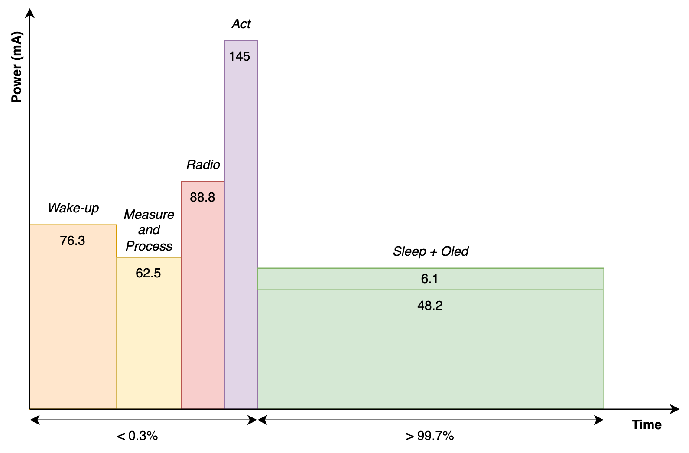
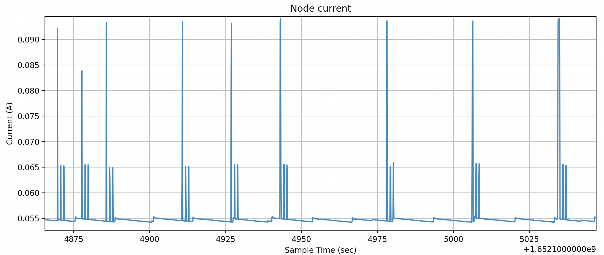
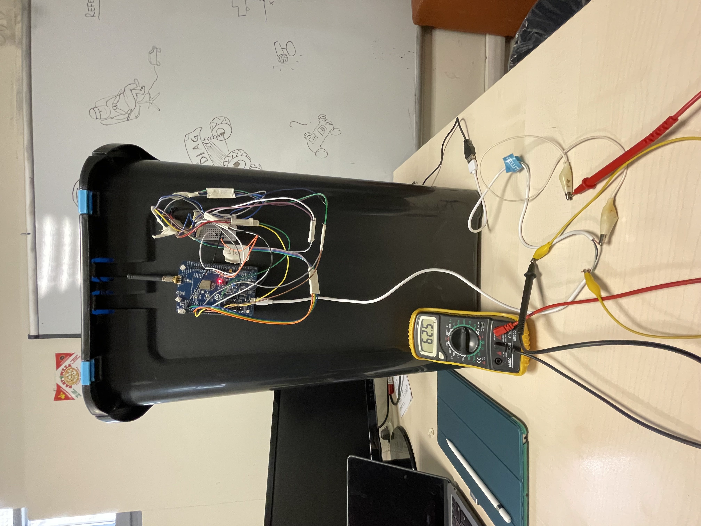
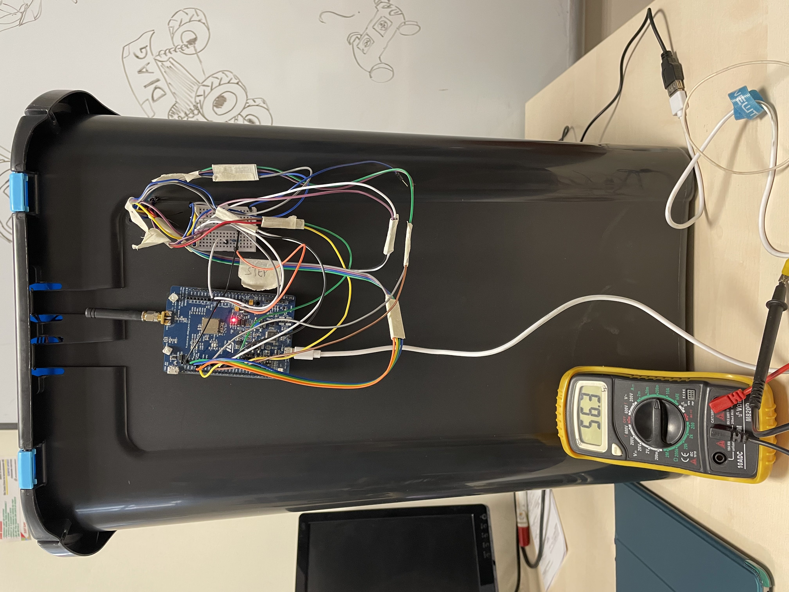
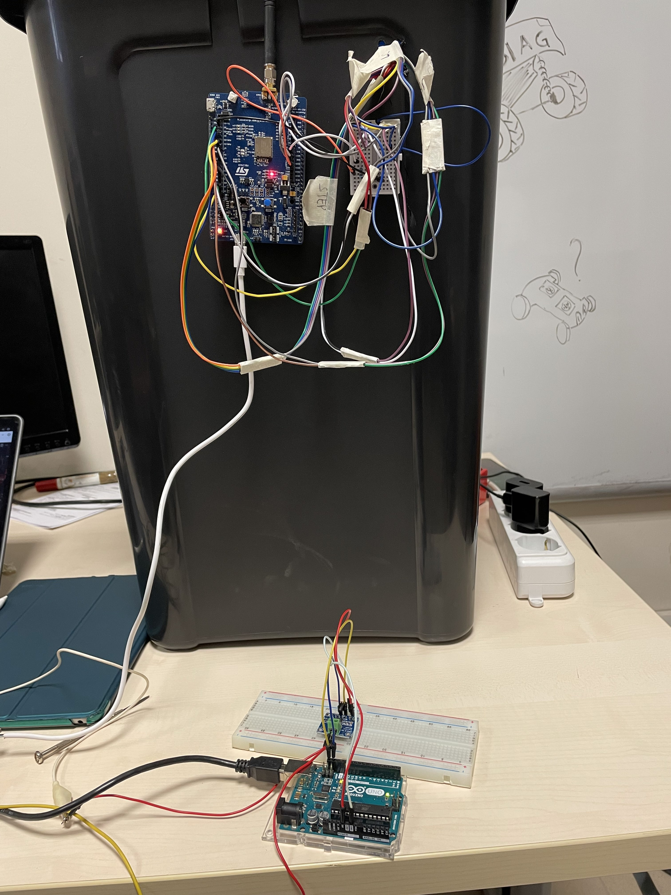
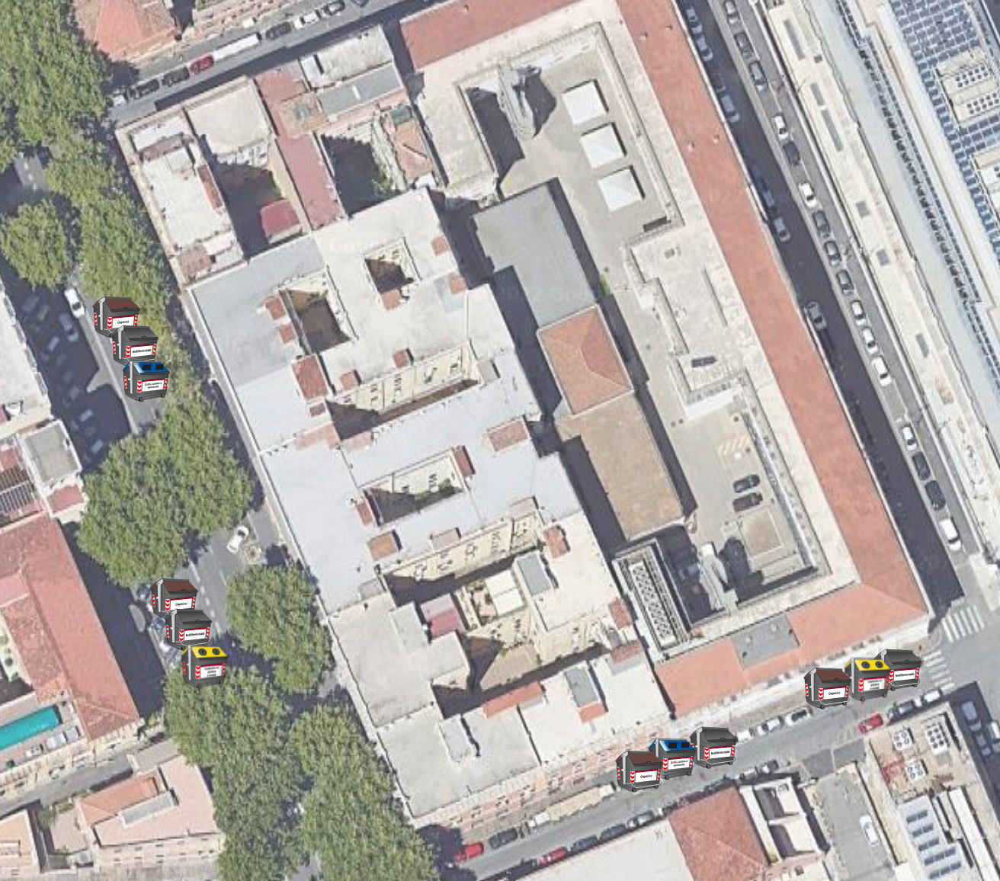
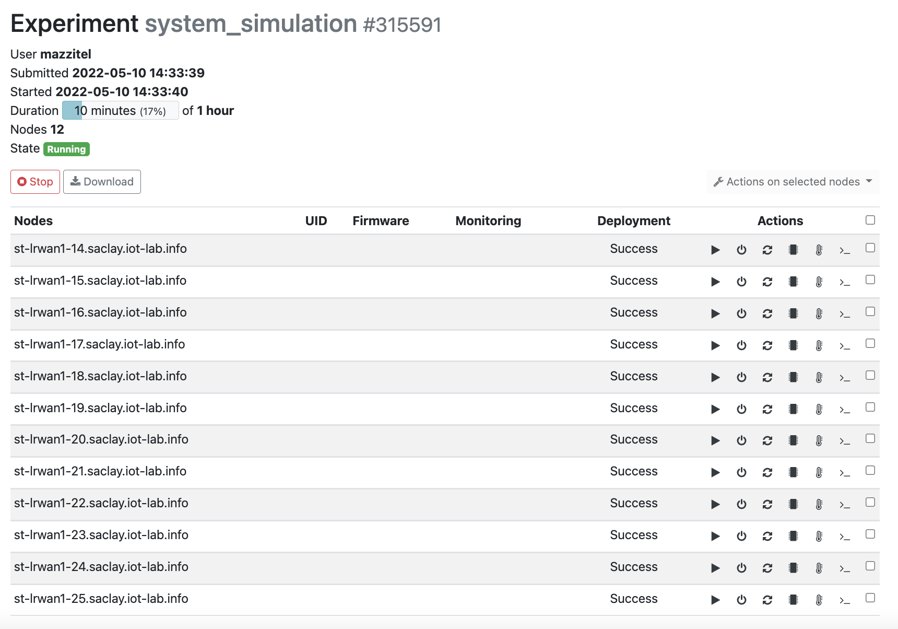

## Requirements:
- The accuracy error of the fill level must be at most 10%;
- The update of the fill levels must be shown in the dashboard within 2 hours from the actual change;
- The system must be energy independent for at least a year;
- The capacity of the bin must not be reduced by more than 5% (both in weight and volume);
- The system must be compliant with the LoRa duty cycle restrictions;
- The ratio of wrong fill level measurments over total fill level measurements must be < 5%.

*These requirements were set making reasonable assumptions on the observed real world.*

## Energy Consumption
A major constraint that we have is energy consumption. We want the system to be energy independent for at least a year, considering the following energy usage:
- The OLED screen will be always on and will be updated at every change of the fill level.
- The stepper motor will be activated only when the bin is full or recently emptied.
- The sensors will be activated at the predefined intervals. The ultrasonic sensor will take three measures with a 30 seconds interval, to discard eventual measures taken while the bin was open. The load cell will also be activated to read a value.

### Replacing the OLED with a e-ink display
To further reduce the energy consumption we could replace the OLED with a e-ink display. Taking as an example the display 1.54inch e-Paper V2 - [WSH-12561](https://www.tme.eu/Document/0ca57a8ffbcd57b5bca53252eb9d6ec3/WSH-12561.pdf), we have that it consumes 0.005mA in standby and 8mA during the update phase. Considering a maximum of 10 updates every day, this display would consume roughly 0.16mAh per day which is extremely less than the 54mAh needed by the Oled display.

### Analysis on sampling frequency
One of the key aspects of the project is how often the sampling is done. Indeed, there are several possibilities:
- Continuous sampling of all the sensors: this first approach is clearly the simplest one. It allows high accuracy and responsiveness to changes but at the cost of always consuming energy. In particular, we have that keeping ON the load cell would cost 5.8mA ([datasheet](https://cdn.sparkfun.com/datasheets/Sensors/ForceFlex/hx711_english.pdf)) and keeping ON the ultrasonic would cost 3.1mA ([datasheet](https://cdn.sparkfun.com/datasheets/Sensors/Proximity/HCSR04.pdf)).
 This totals up to 8.9 mA. Considering a 1000mAh battery only for the sensors, they would run for 60.61 hours, which is less than 5 days. That result is clearly unacceptable for an application like ours. Indeed, the goal is to have a battery which lasts for no less than a year, also considering that it must give power also to the board and to the actuators.
 Moreover, continuous sensing does not make much sense in our use case. Seeing the nature of what we are measuring (i.e. people throwing away garbage), we expect random changes in the values with random intervals between them (also long periods of time in which the values do not change). This behavior clearly describes discrete events and not continuous ones, strengthening our claim of continuous sensing being unnecessary.
- Continuous sensing of one sensor and sensing of the other only when needed: this approach may be a viable solution that allows us to promptly detect changes in the environment, using the other sensor only as confirmation for the action to take. This method falls in the same shortcomings of the previous one, especially regarding the energy consumption. In particular, if we keep the ultrasonic sensor always ON with a battery of 1000 mAh, it would last for 13.44 days. This result is clearly an improvement but still not nearly enough for our goal of changing the battery not more than once a year.
 If keeping the ultrasonic sensor always on is not a good solution, clearly keeping on the load cell (that uses more mA than the ultrasonic sensor) is not a viable possibility. Moreover the considerations done on the nature of the environment still holds.
- Periodic sensing: this is the solution that we went for. We believe it is a good compromise between energy consumption and data availability. It is also possible to tailor the interval between measurements, during the development we choose for our application an interval of 1 hour.
 We came up with this value using some empirical observations and some reasoning: considering that in Rome the bins get emptied on average every 2 days and that our “fill level scale” is 0-9, we deduced that to accurately detect every level we would need to measure at least every 48/10 = 4.8 hours. Using a bigger interval we would lose accuracy in detecting when the fill level changes. Moreover we need to have a recent enough update so that the trucks can have a realist view to plan their route.
 A possible solution to allow trucks for better planning is to allow for sensing on request. This would imply keeping the radio always on which is unfeasible due to battery constraints.  In particular we chose a one hour interval because it allows us to cope with times in which there is more frequent activity (people tend to throw the garbage in defined times of the day, in the morning and in the evening). Sensing at intervals less than an hour would increase energy consumption and in normal situations we do not expect big changes in the fill level during this period of time.
 Assuming to use this method, we would keep both sensors ON for a few seconds every hour, which means roughly we would consume 8.9mA that corresponds to a battery lifetime of more than 9 years (assuming a 1000 mAh battery only for the sensors, one sensing every hour and 5 seconds to startup, sense and shutdown).
- We could introduce some machine learning techniques to tailor the sampling rate to the real needs. Having collected enough data on the times of the day when the bins are more used, we could know when sensing was useless (because the fill level was unchanged) and when it should have been more frequent. As a consequence we could adapt the sampling rate depending on this. We could also do a step forward by changing the sampling rate of each single bin, based on its specific needs.

### Analysis on radio usage
The second aspect that has a great impact on the consumption of energy is how often the radio is used. We came up with several possibilities:
- Transmit every new value: we would transmit data every time the sensors perform a new measurement. This solution allows to keep the radio active only a few seconds every timeout. But we do not need to know if a fill level has not changed, as for our system we are only interested in fill level changes.
- Transmit every time a fill level changes: in this case we would transmit data every time the fill level of the bin changes with regard to the previous measurement. We reduced even more the energy consumption with respect to the previous case, without losing any relevant information on the status of the bins.

The antenna will be also activated when an anomaly is detected between the fill level measure taken by the ultrasonic and the weight measured by the load cell. In that case it will be used to notify the anomaly, sending the max fill level to the cloud to notify the bin must be emptied.

In conclusion we chose to sense every hour and to send data every time there is a change in the fill level of the bin or there is an anomaly. In this way we can also be compliant with the LoRa duty cycle restrictions and with the requirements about the latency between the change in the fill level and the result visualized in the dashboard.

### Measured energy consumption
We used a multimeter and a [INA219](https://cdn-learn.adafruit.com/downloads/pdf/adafruit-ina219-current-sensor-breakout.pdf) to measure the energy consumption of our system.

- 76.3mA Energy consumption during wake-up time
- 48.2mA + 6.1mA Energy consumption of the board + the OLED display
- \+ 8.2mA Energy consumption to activate the sensors and compute the fill level (total 62.5mA)
- \+ 34.5mA Energy consumption to transmit data using LoRa (total 88.8mA)
- \+ 90.7mA Energy consumption of the Stepper (total 145mA)

The measured comsumption can be visualized in the following plot:

Through IoTLAB we measured the energy consumption during the sending of LoRa packets of the board we used. The image below shows the consumption we obtained through a monitoring profile:

Through the use of INA219, a Arduino UNO and the Adafruit INA219 library we obtained more precise measurements of the energy consumption of the running system:

### Battery
To power the system we must use a battery, as there is no infrastructure to keep the device plugged in. Considering the measured energy consumption and the requirements, we would need a 500A battery without using charging methods. Searching for such kind of batteries we found out their weight is not less than 35kg. Considering standard bins with a capacity of less than 500kg, that battery would violate the constraints about the reduction of capacity. Considering that conclusion we must implement some kind of charging method or loosen the constraints.

### Charging methods
We could add a solar panel to reduce the size of the needed battery and increase the lifetime. We would not have any problem finding the space to add the panel due to the size of standard bins. Considering a 5W solar power system like the [K-P105-V50-E309](https://voltaicsystems.com/5-watt-power-system/) we could obtain 7-17Wh per day according to its datasheet. Having a 5V system it could provide 1400-3400mAh per day, which are more than enough to power our device. Moreover the considered power system is also composed of a 12800mAh battery which could power our system for almost 10 days without being recharged due to environmental issues.
In regular situations this solar power system would make our device self-sufficient in terms of energy.

A different option would be using the energy provided by users pressing on the pedal to open the bin. This mechanical energy could be converted into electric energy using a dynamo. However, even if the frequency of this action is considerably high, the energy produced every time would not be able to support the consumption of the whole system. Moreover not every bin today uses this mechanism to be opened.

## Sensors precision
The precision of the fill level depends on the height of the bin. The fill level is a value between 0 and 9, computed as `fill_level = 9-(10*distance/max_distance)`. Consequently every step of the fill level will represent a height value of the trash between `fill_level*max_distance/10` and `(fill_level+1)*max_distance/10`. As a consequence we have an intrinsic error percentage of maximum 10% of the total height, which is compliant with the requirement about the accuracy of the fill level.

We measured the precision of the load cell with respect to the conversion formula we used. From the tests we have done we discovered a 2% error, which is acceptable. It is also counterbalanced by the 20% margin used when comparing weights in the code.

We conducted some tests to evaluate the accuracy of the system. 
  Total measurements: 40.

| Fill level from ultrasonic sensor | Total measurements | Detected anomalies | Undetected anomalies |
| ----------- | ----------- | ----------- | ----------- |
| 0 | 2 | 0 | 0 |
| 1 | 3 | 0 | 0 |
| 2 | 5 | 0 | 0 |
| 3 | 4 | 0 | 0 |
| 4 | 7 | 0 | 0 |
| 5 | 6 | 1 | 0 |
| 6 | 3 | 0 | 0 |
| 7 | 3 | 1 | 0 |
| 8 | 4 | 0 | 1 |
| 9 | 3 | 0 | 0 |
| ----------- | ----------- | ----------- | ----------- |
| Total | 40 | 2 | 1 |

Accuracy of the fill level: 92.5%. We expect the accuracy to rise with a greater sample dataset so to be compliant with the requirement about the error rate.

## Network usage

This architecture does not have any particular network constraint. As we planned to send data to the cloud only when the fill level changes or if there is an anomaly, the board should send around 10 messages every interval between two bin unloadings. This choice has been made considering the nature of the system which does not need real time updates.

The great number of bins dislocated throughout the city should be supported by the gateway infrastructure.

The latency measured using the prototype from the sending to the update of the web dashboard is less than 2 seconds, which is more than enough for our use case.

We’ll send to the cloud only the fill level of the bins and the bin identifier, so the bandwidth needed by each device is minimal. The size of the payload sent using LoRa to the cloud is less than 10bytes (1 for the fill level, 1 for the separator character and up to 8 for the bin identifier). To reduce the network usage we could also remove the bin identifier from the message, using the DEV_EUI assigned to the board as bin identifier.

We plan to test the whole system using a simulated environment provided by IoT_LAB. In this way we will also analyze the scalability of our system.

## Scalability

To be sure our system would work in the real world environment, we also tested its scalability. We chose a block in our city and created an entity in the database for each of the bins:

We used IoTLAB and created an experiment reserving 12 boards b-l072z-lrwan1 on the Saclay site. 

We wrote some RIOT OS code to connect to the LoRa gateway, repeatedly generate random fill levels and send them to the cloud. This code was compiled and flashed on every board, using different DevEUI, AppKey and AppEUI which were linked to different bin entities in the database. The experiment ran smoothly to prove our system was capable of supporting more devices.

Here you can see an extract of the recorded experiment:

From this experiment we realized we cannot use the WebSocket technology to update the dashboard every time a bin sends its fill level. Due to the high number of bins, the web dashboard could not keep up with all the updates and kept refreshing. Moreover we realized that the cloud would have had to send a high number of messages to every open dashboard. Analyzing our application, we realized that there is no need for such a feature. Indeed, the latency from the change in the fill level to the update on the cloud can be up to 1 hour. So there is no reason to implement a low latency mechanism in the dashboard. In the end we decided to force the web interface to update every 10 minute, so as not to overload the cloud with requests.

### Link to previous version: [Evaluation - Second delivery](../Second%20Delivery/Evaluation.md)
