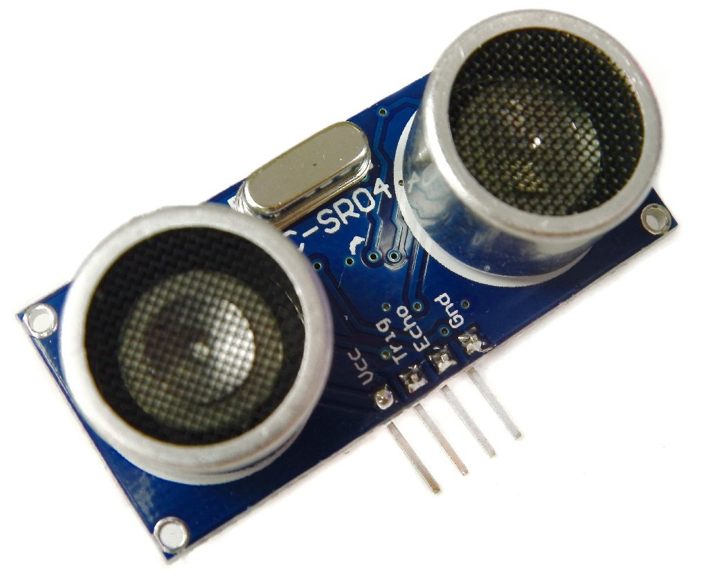
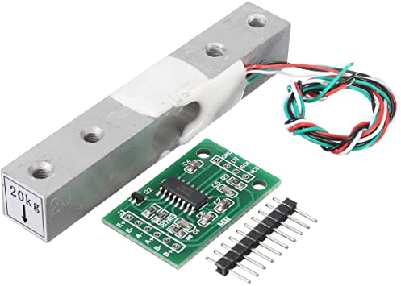
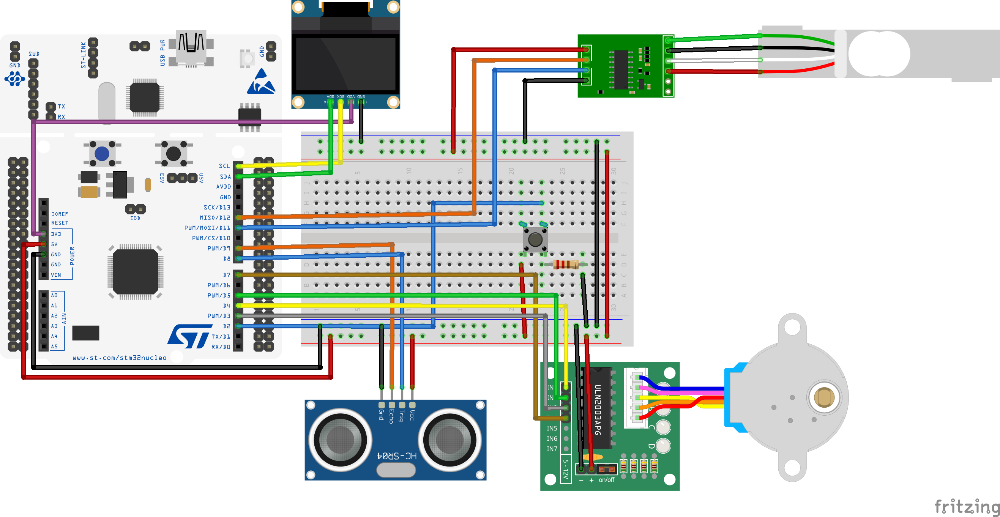

# TECHNOLOGY

## General Architecture

The computation is carried both on the edge and in the cloud. Every board will compute the fill level through the data coming in from the sensors and will send only this refined value to the cloud when it changes. The cloud will generate a dashboard with a map of the city combining the data received together with the database which links every bin identifier to its location. This dashboard will be publicly available through http both to the garbage collection company and to the citizens.

## Bin Overview

Every smart bin is equipped with:

***LoRaWAN compatible STM board***

STM32L0 Discovery kit LoRa, Sigfox, low-power wireless. The module is powered by an STM32L072CZ microcontroller and SX1276 transceiver. The transceiver features the LoRa long-range modem, providing ultra-long-range spread-spectrum communication and high interference immunity, minimizing current consumption.
In the cities there should be some LoRaWAN gateways to pick up all the signals sent by the bins.
We used LoRa as communication protocol between the Smart bins and TheThingsNetwork. Using the integration between TheThingsNetwork and AWS IoTCore we receive the messages in the broker provided by AWS.
To allow the communication the following parameters must be set in the main.h file: dev_eui, app_eui, app_key. 

***Ultrasonic sensors*** to measure occupied volume in the bin.

We use ultrasonic sensors as the main way of measuring the fill level of the bins. In the prototype we used only one sensor but we decided to take three measures every time with a 30 seconds timeout. In this way we can discard measurements taken while the bin was open. Using more ultrasonic sensors would enhance the accuracy of the measures but implies a linear increase in the energy consumption of the sensors of the whole system.

***Load cells and a Load Cell Amplifier*** to measure the weight of the trash in the bin.

To detect anomalies in the data read by ultrasonic sensors we use a load cell. Together with statistics based on gathered data we can compare the occupied volume in the bin and the weight to understand if there is an anomaly in the ultrasonic measure. To estimate the weight based on the ultrasonic measure and to estimate the maximum weight, the following parameters must be set in the main.h file: height of the bin in cm, base area of the bin in square meters, waste type (plastic, metal, glass, paper, food, mixed).

To convert the value read from the load cell into grams we tested it using different weights. We then analyzed the measurements and discovered a linear pattern. Consequently, to convert the value returned from the load cell we must subtract it from the base value (8500 in our case) and divide it by 0.104.

***Button*** to open the bin when it is locked.

***OLED Display*** to show the fill level to the citizens.

The OLED Display provides information about the fill level as feedback to the citizens. It shows a numeric value together with the progress bar. In this way they can be more involved in the process and take responsibility. 

***Stepper motor*** to lock the opening of the bin when it is full and to unlock it when it gets emptied.

### All the components are wired following the diagram below:

## The prototype

To see first hand how our system would be implemented on a real bin, we built a prototype. Starting from a standard bin we used hot glue and some 3D printed parts to put on the bin: sensors, actuators and the board.
We used a different kind of bin from the one shown in the overview. That is because of the unavailability of a standard garbage bin in this first development phase. However, the system we built is easily adaptable to different kinds of bins.
What you can see in these photos is the final result:

## Logic
The RIOT code implements the logical computation carried out in the LoRa board. In the main function it initializes the sensors, the actuators and the LoRa communication parameters.
It then starts a loop which alternates an active phase and a sleeping phase.

In the active phase the code does the following:
- the ultrasonic sensor makes three measurements with a 30 seconds timeout
- among the three values it rules out eventual anomalies and choose the pertinent one
- it then converts it to a fill level between 0 and 9 knowing the height of the bin
- the load cell is used to get the weight of the trash inside the bin
- based on the fill level and the type of garbage, it computes the estimated weight
- it also computes the maximum weight based on the height of the bin, the base area and the type of garbage

- if the fill level is lower than 8 but the weight is more than the maximum one (with a 20% margin) we have an anomaly; it sends to the cloud a fill level of 9 to notify the bin must be emptied but it does not close the bin.
- else if the fill level has changed from the previous measurements it sends the fill level to the cloud and updates the values on the OLED display. Then it also checks:
  - if the weight is below the estimated one (with a margin of 20%) when the fill level is greater or equal than 8; in that case it keeps the bin open
  - else if the fill level is greater or equal than 8 and the weight is coherent, it closes the bin
  - else it opens the bin

Moreover a separate thread is used to handle the bin’s opening using the button:
- if the button is pressed and the bin is locked then it is unlocked.

### Accuracy of the fill level
The fill level is computed from the measures taken by the ultrasonic sensor. Its accuracy can be an issue since the sensor measures the distance of a small area of the bin.
 As a consequence it could happen that in this area there is a lot of trash while the remaining space is empty. For this reason we decided to take into consideration also the weight measured through a load cell to implement a double check measure.
 Indeed we verify if the real weight measured is similar to the estimated weight with a margin of 20 percent (computed by using the fill level of the bin, the base area and the waste type). This double check allows us to detect a mismatch between the two measurements and makes us aware of any anomaly in the system.

- An anomaly is detected when the fill level is greater or equal than 8 and the weight is lower than the estimated one. We decided not to close the bin (since the bin could be not really full) while still sending the fill level to the cloud. Because of the mismatch between the measurements of the two sensors, we do not really know if the bin is actually full or not. Indeed we prefer to leave the bin open during an anomaly even if it is actually full instead of closing it while it is still empty.
- Another anomaly could happen if the load cell returns a weight greater than the maximum one (with a margin of 20 percent) but the fill level is smaller than 8. Also in this case we decided to adopt the same policy as before, keeping the bin open and sending 9 as fill level to the cloud. In this way an operator will empty the bin and solve the anomaly.

Another solution is to add more ultrasonic sensors to the system; this solution would increase the cost in terms of power consumption but it would be more precise in detecting the fill level of the bin.

## Network

This architecture does not have any particular network constraint. We update the data on the cloud either when the fill level changes or when an anomaly is detected by the load cell. This choice has been made considering the nature of the system which only needs to know the last measured fill level.
We send to the cloud only the fill level of the bin, so the bandwidth needed by each device is minimal. Even though we take into account the great number of bins that even a small city has, the payload transmitted by each one is 1 byte every time the fill level changes (it should be no more than 10 times between two bin unloadings). Having planned a high update latency implies fewer usage of the radio that can be turned off during sleep times saving energy.

We ruled out every kind of communication directed to the board as it would need the radio always on. We couldn’t afford that in developing a battery powered device that needs to be up for at least a year without a constant power supply.
  We also considered structuring the network as a mesh to avoid the need of developing a gateway infrastructure. However, this approach would also require the radio to be always on but, as stated before, we cannot afford that.
  Different solutions must be researched to have a gateway infrastructure available. The garbage pickup company could develop its own infrastructure or it could use an existing infrastructure provided by some third party.

LoRa has been chosen as communication protocol because of its low power consumption and long range. Its main constraint is the low bitrate but it is still suitable for our project. WiFi and Bluetooth could provide higher bitrate but lower range, which is not ideal for our system. 3G/4G/5G could also provide not only higher bitrate and high range, but also an existing and wide gateway infrastructure. The main drawback of these technologies is the power consumption which is higher than the one we can support.

## Cloud

The cloud part of the project is composed by the following elements:
- The Things Network
- AWS IoT Core
- AWS Lambda Function
- AWS DynamoDB
- AWS Amplify
- APIs provided by Google Maps.

The format of the messages sent from the board is the following: `fill_level`.

The DataBase is composed of a single table `binTable(DevEUI, id, lat, lng, last_fill_level, last_fill_timestamp)` in which:
- the DevEUI assigned to the device is used as primary key of the table; 
- id is used to identify the bin on the web dashboard;
- lat and lng are the geographic coordinates where the bin is located;
- last_fill_level is the last fill level received from the board;
- last_fill_timestamp is the timestamp at which the last fill level was received.

As the primary key of the table we decided to use the DevEUI assigned to each bin. In this way we can immediately associate the messages received to the respective bin using information that is automatically sent in the exchange, without the need to add more information in the message payload.
We also chose to use an ID to identify in a simpler way the bins in the web dashboard. Being the bins often one near the other, a garbage truck driver can use the ID to understand which bin needs to be emptied. Clearly, the id should be written on the physical bin. 

When a message containing the fill level is sent to a LoRa Gateway in The Things Networks (TTN), TTN relays the incoming message to the MQTT Broker in the AWS IoT Core.
Once the IoT Core receives a new message on the broker, using its Rule Engine, it calls the Lambda Function “writeBinTable_v2”. This function updates the tuple in the DB that has the DevEUI as the one in the message that just arrived.

The user interacts with AWS Amplify to get the static content. Once the page on the client browser completely loads, it runs the javascript code that generates the map with markers where bins are located. The user can now click a marker to see the bin id, the last fill level and the time when the last fill level was detected.
In particular, the js code does the following:
- it calls the Google Maps API to retrieve the map;
- it calls the Lambda function “getBin_v2” using the “Function URL” that returns all the tuples inside “binTable” ([here](https://docs.aws.amazon.com/lambda/latest/dg/lambda-urls.html) there is a description of what is a function URL);
- once the data arrives, for every bin the script adds a clickable marker containing all the info about the bin with a different color depending on the fill level;
- every 10 minutes the dashboards reloads, we chose not to update it in real time using websockets due to scalability concerns.

From the web interface the user can also add a new bin to the system by filling the latitude and longitude fields and clicking on the “Add Bin” button. It calls the function URL of the “addBin_v2” Lambda Function that creates a new tuple in “binTable” and returns to the user the new bin id.

Moreover the user can delete a bin from the system by inserting the id in the corresponding field and then clicking on the “Delete Bin” button. In this way the Lambda function “deleteBin” is called and the tuple associated with the specified bin’s id is deleted from the DB.

All the data stored in the database can also be reached via a REST API, to ease the integration with pre-existing management systems of the garbage pickup companies. You can call it from [here](https://slfosy6btrlq2u2xufldfoy5fi0reboc.lambda-url.us-east-1.on.aws/).

## Future plans for technology improvements:

### Edge computing
We could use edge computing to run a machine learning algorithm which learn and adjust the interval between measurements. We could also use it to learn the specific weights of every waste type.
Both these algorithms could be implemented in different ways:
- using all global data coming from every bin, in this case gateways should be orchestrated to learn the global parameters. This option is the best one to learn the specific weights of waste.
- using all data received by a single gateway, in this way we would have neighbourhood specific parameters.
- using data coming from a single bin, in this way we would have specific parameters for every bin. This option is the best one to learn the interval between measurements.

To achieve the proposed goals, edge computing would be the best option because the boards do not have enough computational power or energy to run complex algorithms. Moreover the gateways already have the necessary data and can communicate with the boards to send the new parameters.

### Replacing the OLED with a e-ink display
To further reduce the energy consumption we could replace the OLED with a e-ink display. This kind of displays consumes a relevant amount of energy only when the values are updated. During standby their energy consumption is negligible.
Taking into account the update frequency of the display in our system, the e-ink option would be more appropriate.

### Charging methods
We could add a solar panel to reduce the size of the needed battery and increase the lifetime. We would not have any problem finding the space to add the panel due to the size of standard bins. More details in the evaluation document.

A different option would be using the energy provided by users pressing on the pedal to open the bin. This mechanical energy could be converted into electric energy using a dynamo. However, even if the frequency of this action is considerably high, the energy produced every time would not be able to support the consumption of the whole system.

### Link to previous version: [Technology - Second delivery](../Second%20Delivery/Technology.md)

